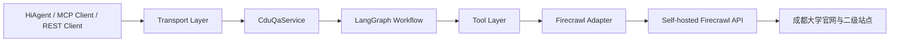
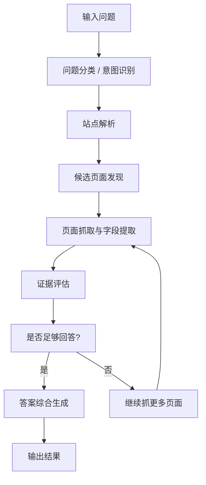

# cdufireseach LangChain / LangGraph 重构落地方案

副标题：面向 HiAgent 低代码平台的智能问答与抓取架构升级设计

## 1. 背景

当前 `cdufireseach` 已经具备以下能力：

- 对外只暴露一个 MCP tool：`ask_cdu`
- 基于成都大学官网与二级站点做定向问答
- 支持同站点内受控递归抓取
- 支持部分规则型字段提取，如 `办公地点 / 联系电话 / 邮箱`

但用户反馈仍然存在一个核心问题：

- 抓到了正确站点和正确页面，但最终答案仍可能不够准确
- 纯规则的页面优先级与字段提取，在复杂页面结构下容易失真
- 不同页面的结构差异较大，单靠启发式规则维护成本会持续升高

因此，需要从“规则主导的问答服务”升级为：

- **确定性抓取 + 大模型智能决策 + 可控工作流编排**

本方案的目标是引入 LangChain / LangGraph，将当前项目升级为：

- 既可继续暴露 `MCP`
- 又可对接 `REST API`
- 可作为 HiAgent 低代码平台中的智能工具调用

## 2. 本次重构目标

### 2.1 业务目标

- 提升“找到正确页面后给出正确答案”的成功率
- 提升复杂问题下的多页面证据综合能力
- 让系统更适合 HiAgent 低代码平台通过 REST 工具接入
- 保留当前 Firecrawl 抓取能力，不推翻现有部署方式

### 2.2 技术目标

- 将当前 `apiAdapter.ts` 中的“大一统逻辑”拆分为明确层次
- 把适合大模型调用的能力封装为 LangChain tools
- 用 LangGraph 管理问答工作流，而不是完全自由的 Agent
- MCP 与 REST 复用同一套服务层，避免双份实现

## 3. 为什么不是直接做“自由 Agent”

本项目场景并不是开放世界问答，而是：

- 限定学校域名
- 限定问答范围
- 需要强约束的 URL 策略
- 需要可解释的抓取与回答过程

因此不建议一上来做：

- 完全自由的 Agent
- 无边界的工具反复试探
- 纯模型驱动的页面抓取决策

更合适的方案是：

- **LangChain tools + LangGraph workflow**

这样可以把系统拆成两部分：

- **确定性逻辑**
  - URL 清洗
  - 同域限制
  - 递归深度
  - 最大页面数
  - Firecrawl 调用
  - 缓存

- **智能决策逻辑**
  - 问题理解
  - 站点候选排序
  - 页面相关性判断
  - 多页面证据汇总
  - 最终答案生成

## 4. 当前系统结构与问题定位

当前关键文件：

- [cdufireseach/src/index.ts](/Users/eisa/Documents/项目文档/开发/Firecrawl/cdufireseach/src/index.ts)
- [cdufireseach/src/tools.ts](/Users/eisa/Documents/项目文档/开发/Firecrawl/cdufireseach/src/tools.ts)
- [cdufireseach/src/firecrawl/adapter.ts](/Users/eisa/Documents/项目文档/开发/Firecrawl/cdufireseach/src/firecrawl/adapter.ts)
- [cdufireseach/src/firecrawl/apiAdapter.ts](/Users/eisa/Documents/项目文档/开发/Firecrawl/cdufireseach/src/firecrawl/apiAdapter.ts)

当前存在的主要问题：

1. `apiAdapter.ts` 同时承担太多职责
   - 站点目录抓取
   - 站点匹配
   - 页面递归发现
   - 启发式字段提取
   - 问答流程编排

2. 对外只有 `ask_cdu` 是对的，但内部流程还没有分层

3. 当前“抓取 + 决策 + 回答”强耦合，后面接 LangChain 时很难局部替换

结论：

- `index.ts` 和 `tools.ts` 应保持轻量
- `apiAdapter.ts` 需要拆分
- LangChain 不应该直接塞进 MCP 入口层

## 5. 推荐新架构



### 5.1 各层职责

#### A. Transport Layer

职责：

- 暴露 MCP 接口
- 暴露 REST API
- 参数校验
- 响应封装

建议保留：

- MCP：`ask_cdu`
- REST：`POST /api/ask`

#### B. CduQaService

职责：

- 统一问答入口
- 协调 LangGraph 工作流执行
- 将 LangGraph 输出转换为统一业务结果

#### C. LangGraph Workflow

职责：

- 组织智能决策流程
- 决定什么时候继续抓更多页面
- 决定是否已有足够证据回答
- 生成最终结果

#### D. Tool Layer

职责：

- 提供可被 LLM 调用的离散能力
- 尽量无副作用、易测试
- 对 Firecrawl 做稳定包装

#### E. Firecrawl Adapter

职责：

- 负责真正的网页抓取
- 保留缓存、清洗、同域限制等确定性能力
- 不负责高层问答决策

## 6. 推荐目录结构

建议重构后目录如下：

```text
cdufireseach/src/
  index.ts
  tools.ts
  routes/
    askRoute.ts
  services/
    cduQaService.ts
  langchain/
    tools/
      resolveCduSiteTool.ts
      fetchCduPageTool.ts
      discoverCduPagesTool.ts
      extractContactFieldsTool.ts
      getCatalogContextTool.ts
    workflows/
      cduQaGraph.ts
    prompts/
      questionClassifier.ts
      answerSynthesizer.ts
      pageRelevanceJudge.ts
  firecrawl/
    adapter.ts
    apiAdapter.ts
    scrapeClient.ts
  catalog/
    catalogService.ts
  types/
    qa.ts
    tool.ts
    api.ts
```

说明：

- `index.ts`：只负责启动 HTTP/MCP 服务
- `tools.ts`：只负责注册 `ask_cdu`
- `routes/askRoute.ts`：新增 REST API 路由
- `services/cduQaService.ts`：统一业务入口
- `langchain/tools/*`：LangChain 工具封装
- `langchain/workflows/cduQaGraph.ts`：LangGraph 编排
- `firecrawl/*`：底层抓取封装

## 7. 哪些现有能力适合做 LangChain Tool

### 7.1 推荐保留并升级为 Tool 的能力

#### `resolve_cdu_site`

作用：

- 根据问题或关键词定位成都大学二级站点

输入：

```json
{
  "question": "人事处人事科在哪里？"
}
```

输出：

```json
{
  "matches": [
    {
      "name": "党委教师工作部（人事处）",
      "website_url": "https://rsc.cdu.edu.cn/",
      "score": 0.93
    }
  ]
}
```

对应当前可复用逻辑：

- `getSiteCatalog`
- `findSite`
- 站点名别名展开与匹配

#### `fetch_cdu_page`

作用：

- 抓取指定页面正文、标题、链接、元数据

输入：

```json
{
  "url": "https://rsc.cdu.edu.cn/jgsz/rsk.htm"
}
```

输出：

```json
{
  "url": "https://rsc.cdu.edu.cn/jgsz/rsk.htm",
  "title": "人事科-成都大学党委教师工作部、人事处",
  "markdown": "...",
  "links": []
}
```

对应当前可复用逻辑：

- `scrape()`
- `markdownLinksToNamedItems()`

#### `discover_cdu_pages`

作用：

- 在目标站点内按深度发现候选页面
- 输出页面候选列表，不直接做最终回答

输入：

```json
{
  "siteUrl": "https://nic.cdu.edu.cn/",
  "question": "网络信息中心在哪里？",
  "maxDepth": 2,
  "maxPages": 8
}
```

输出：

```json
{
  "pages": [
    {
      "url": "https://nic.cdu.edu.cn/",
      "depth": 0,
      "score": 0.91
    },
    {
      "url": "https://nic.cdu.edu.cn/zxgk/jgsz.htm",
      "depth": 1,
      "score": 0.82
    }
  ]
}
```

对应当前可复用逻辑：

- `selectCandidateUrls`
- 页面内链接发现
- 深度与页面数控制

#### `extract_contact_fields`

作用：

- 从指定页面中抽取办公地点、电话、邮箱等结构化字段
- 支持“具体科室块优先”的提取策略

输入：

```json
{
  "question": "人事处人事科在哪里？",
  "focusTerms": ["人事科"],
  "markdown": "..."
}
```

输出：

```json
{
  "location": "办公地点：行政保障中心A328、A330",
  "phone": "联系电话：（028）84616040、84616225",
  "email": null
}
```

对应当前可复用逻辑：

- 当前的启发式字段提取逻辑
- 后续可逐步接入模型增强版字段抽取

#### `get_catalog_context`

作用：

- 给大模型提供站点目录上下文

适合在问题理解阶段使用，帮助模型理解：

- “网络信息中心”和“信息网络中心”是同一对象
- “党委教师工作部（人事处）”中的“人事处”是别名

### 7.2 不建议直接做 Tool 的能力

#### 不建议把 `askSite()` 直接作为 Agent tool

原因：

- 它已经是一个完整的总控黑盒
- 如果让 LangChain 再调用它，就相当于“智能体调用另一个完整智能体”
- 会导致流程无法细粒度控制

结论：

- `askSite()` 应逐步降级为旧版 orchestrator
- 新的 LangGraph 工作流直接调用更细粒度工具

## 8. LangGraph 工作流设计

建议的图结构如下：



### 8.1 节点说明

#### 节点 1：问题分类

输出：

- 问题类型：位置 / 电话 / 邮箱 / 简介 / 通用问答
- 问题中的重点对象：如 `人事科`

#### 节点 2：站点解析

输入：

- 原始问题
- 站点目录上下文

输出：

- 候选站点列表
- 最优站点

#### 节点 3：候选页面发现

输入：

- 站点 URL
- 问题类型
- 焦点词

输出：

- 需要优先抓取的页面列表

#### 节点 4：页面抓取与字段提取

输入：

- 页面 URL

输出：

- 页面正文
- 链接
- 结构化字段
- 页面相关性评分

#### 节点 5：证据评估

作用：

- 判断当前页面证据是否足够回答问题
- 判断是否还需要继续抓取更多页面

#### 节点 6：答案综合生成

作用：

- 基于多页面证据给出最终答案
- 保证回答简洁准确
- 附带 evidence 与 source_urls

## 9. 大模型介入位置建议

### 9.1 必须由大模型参与的部分

- 问题意图识别
- 站点候选语义排序
- 页面相关性判断
- 多页面证据汇总
- 最终答案生成

### 9.2 应尽量保留为确定性逻辑的部分

- URL 清洗
- 同域约束
- 递归深度 / 最大页面数控制
- Firecrawl 调用
- 缓存
- 页面抓取失败后的降级策略

### 9.3 推荐模型调用方式

建议统一做一个模型抽象层，例如：

```text
src/llm/
  client.ts
  schemas.ts
  prompts.ts
```

这样后续可以自由切换：

- OpenAI
- 火山
- DashScope
- 私有模型网关

而不会让 LangChain 逻辑直接依赖某一家模型厂商。

## 10. REST API 设计

HiAgent 更适合通过 REST 工具集成，因此建议新增：

### 10.1 `POST /api/ask`

请求：

```json
{
  "question": "人事处人事科在哪里？"
}
```

响应：

```json
{
  "answered": true,
  "answer": "办公地点：行政保障中心A328、A330",
  "evidence": "页面正文“人事科”栏目中写明：办公地点：行政保障中心A328、A330",
  "analysis_steps": [
    "识别问题类型为位置查询",
    "定位到党委教师工作部（人事处）站点",
    "优先检查人事科页面",
    "从正文提取到办公地点"
  ],
  "matched_site": {
    "name": "党委教师工作部（人事处）",
    "website_url": "https://rsc.cdu.edu.cn/"
  },
  "source_urls": [
    "https://rsc.cdu.edu.cn/jgsz/rsk.htm"
  ],
  "fetched_at": "2026-04-22T10:00:00+08:00"
}
```

### 10.2 `GET /healthz`

继续保留，便于部署检查。

### 10.3 可选 `POST /api/debug/ask`

仅调试环境使用，支持返回：

- 站点候选
- 页面候选
- 各页面评分
- 中间工具输出

生产环境不建议默认开放。

## 11. MCP 与 REST 如何共用同一套逻辑

推荐结构：

- MCP 工具 `ask_cdu`
  - 直接调用 `CduQaService.ask(question)`

- REST 接口 `/api/ask`
  - 也调用 `CduQaService.ask(question)`

也就是说：

- **MCP 和 REST 不各写一套逻辑**
- 统一使用同一个服务层

## 12. 对 HiAgent 的接入建议

HiAgent 低代码平台建议使用：

- 一个 REST 工具
- 路由固定为 `POST /api/ask`
- 输入只保留一个字段：`question`

这样对低代码平台最友好：

- 不需要理解站点定位和抓取策略
- 不需要知道 Firecrawl 的存在
- 不需要区分目录工具与问答工具

HiAgent 侧调用链就是：

```text
用户问题 -> HiAgent -> REST工具(/api/ask) -> CduQaService -> LangGraph -> Firecrawl -> 返回答案
```

## 13. 分阶段实施建议

### 第一阶段：服务分层

目标：

- 先不接 LangChain
- 先把现有逻辑拆层

任务：

- 从 `apiAdapter.ts` 中拆出：
  - catalog service
  - page fetch service
  - field extraction service
  - QA orchestration service

交付结果：

- 当前逻辑结构更清晰
- 为 LangChain 接入做准备

### 第二阶段：引入 LangChain tools

目标：

- 把现有能力封装成 tool

任务：

- 实现：
  - `resolve_cdu_site`
  - `fetch_cdu_page`
  - `discover_cdu_pages`
  - `extract_contact_fields`

交付结果：

- 已具备 Agent 编排基础

### 第三阶段：引入 LangGraph workflow

目标：

- 用图式工作流替换当前硬编码问答流程

任务：

- 实现问题分类
- 站点解析
- 页面发现
- 证据评估
- 答案综合

### 第四阶段：暴露 REST API 给 HiAgent

目标：

- 提供稳定对接入口

任务：

- 实现 `/api/ask`
- 增加鉴权、日志、超时控制、错误码

### 第五阶段：观测与优化

目标：

- 让系统可持续维护

任务：

- 记录问题命中率
- 记录失败页面
- 记录证据来源
- 分析误答 / 漏答案例

## 14. 风险与注意事项

### 14.1 成本风险

引入 LLM 后，调用成本会上升。

建议：

- 保持强缓存
- 控制最大页面数
- 控制最大模型调用轮次

### 14.2 可解释性风险

如果让 Agent 过度自由，问题会变得不可解释。

建议：

- 记录每次 tool 调用
- 保留 `analysis_steps`
- 保留 `source_urls`

### 14.3 抓取稳定性风险

Firecrawl 仍然是底层关键依赖。

建议：

- 对抓取失败做分层重试
- 保留当前规则型 fallback 能力
- 不要把所有能力都交给 LLM

## 15. 结论

本次重构建议不是“推翻当前项目重写”，而是：

- 保留 Firecrawl 自托管抓取层
- 保留当前 MCP 与 HTTP 服务入口
- 拆出可复用的抓取与提取能力
- 在中间新增：
  - `CduQaService`
  - `LangChain tools`
  - `LangGraph workflow`
- 最终同时支持：
  - `MCP ask_cdu`
  - `REST /api/ask`

对 HiAgent 来说，推荐最终接入方式是：

- **REST API 优先**

对当前仓库来说，最合理的实施顺序是：

1. 先做内部服务分层
2. 再做 LangChain tools
3. 再接 LangGraph
4. 最后提供 REST API 给 HiAgent

---

如果后续进入实施阶段，建议把第一阶段任务拆成一个独立开发里程碑：

- `v0.2.x`：服务分层与 REST 化准备
- `v0.3.x`：LangChain tools 接入
- `v0.4.x`：LangGraph 智能编排上线
