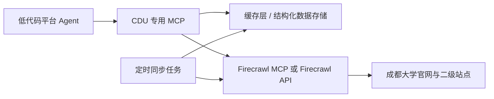

# cdufireseach 设计稿

副标题：成都大学官网专用 MCP 设计稿

## 1. 目标

为低代码平台 Agent 提供一个面向成都大学官网的专用 MCP 服务，支持稳定查询以下内容：

- 成都大学首页导航信息
- 组织机构
- 院系设置
- 院系二级网站入口
- 指定学院或部门的站点链接与基础信息

本服务不追求开放式全网搜索，重点是：

- 结果稳定
- 输出结构化
- 限定站点范围
- 便于低代码平台调用

## 2. 适用站点范围

核心站点：

- `https://www.cdu.edu.cn/`
- `https://www.cdu.edu.cn/zzjg.htm`
- `https://www.cdu.edu.cn/yxsz.htm`

扩展范围：

- `cdu.edu.cn` 域名下二级栏目页
- “院系设置”页面中列出的院系二级网站
- 若二级网站使用独立子域名或独立域名，允许纳入白名单

## 3. 总体架构



说明：

- 低代码平台不直接调用 Firecrawl 全量能力
- 中间增加一层“CDU 专用 MCP”
- CDU MCP 只暴露学校场景相关 tools
- Firecrawl 负责底层网页抓取、链接发现、批量抓取
- 缓存层用于提升稳定性与响应速度

## 4. 设计原则

- 站点限定：默认只允许访问学校官网及批准的二级站点
- 工具收敛：只提供学校场景所需工具，不暴露过多通用工具
- 结果结构化：统一返回 JSON，避免把原始 Markdown 直接交给低代码平台处理
- 可缓存：优先读缓存，必要时回源抓取
- 可追踪：保留来源 URL、抓取时间、数据版本
- 可扩展：后续可增加“通知公告”“教师信息”“招生就业”等模块

## 5. 推荐能力边界

建议把服务定义为“校园官网知识查询 MCP”，而不是“网页搜索 MCP”。

建议支持：

- 首页导航查询
- 组织机构查询
- 院系清单查询
- 学院详情与站点入口查询
- 站内定向检索

建议暂不支持：

- 全网开放搜索
- 用户任意 URL 抓取
- 大规模无边界 crawl
- 文件下载与全文解析

## 6. MCP 工具设计

### 6.1 `get_home_navigation`

用途：

- 获取成都大学首页的主要导航栏目

输入：

```json
{}
```

输出：

```json
{
  "site": "成都大学",
  "source_url": "https://www.cdu.edu.cn/",
  "fetched_at": "2026-04-10T16:00:00+08:00",
  "navigation": [
    {
      "name": "组织机构",
      "url": "https://www.cdu.edu.cn/zzjg.htm"
    },
    {
      "name": "院系设置",
      "url": "https://www.cdu.edu.cn/yxsz.htm"
    }
  ]
}
```

数据来源：

- `scrape(首页)`

---

### 6.2 `get_org_structure`

用途：

- 获取“组织机构”页面中的组织分类和机构列表

输入：

```json
{
  "refresh": false
}
```

输出：

```json
{
  "source_url": "https://www.cdu.edu.cn/zzjg.htm",
  "fetched_at": "2026-04-10T16:00:00+08:00",
  "groups": [
    {
      "group_name": "党政管理机构",
      "items": [
        {
          "name": "党委办公室",
          "url": "https://..."
        }
      ]
    }
  ]
}
```

数据来源：

- `scrape(组织机构页)`
- 必要时对详情链接做 `batch scrape`

---

### 6.3 `get_departments`

用途：

- 获取“院系设置”页面中的学院、研究院、附属单位等清单

输入：

```json
{
  "refresh": false
}
```

输出：

```json
{
  "source_url": "https://www.cdu.edu.cn/yxsz.htm",
  "fetched_at": "2026-04-10T16:00:00+08:00",
  "departments": [
    {
      "name": "机械工程学院",
      "category": "学院",
      "website_url": "https://...",
      "parent_page": "https://www.cdu.edu.cn/yxsz.htm"
    }
  ]
}
```

数据来源：

- `scrape(院系设置页)`

---

### 6.4 `find_department_site`

用途：

- 根据院系名称查询对应二级网站

输入：

```json
{
  "keyword": "机械工程学院"
}
```

输出：

```json
{
  "keyword": "机械工程学院",
  "matches": [
    {
      "name": "机械工程学院",
      "website_url": "https://...",
      "source_url": "https://www.cdu.edu.cn/yxsz.htm",
      "last_synced_at": "2026-04-10T16:00:00+08:00"
    }
  ]
}
```

数据来源：

- 优先缓存
- 缓存缺失时回源抓取 `院系设置`

---

### 6.5 `get_department_profile`

用途：

- 获取指定院系官网首页的基础信息

输入：

```json
{
  "department_name": "机械工程学院",
  "refresh": false
}
```

输出：

```json
{
  "department_name": "机械工程学院",
  "website_url": "https://...",
  "title": "成都大学机械工程学院",
  "summary": "院系简介摘要",
  "important_links": [
    {
      "name": "学院概况",
      "url": "https://..."
    },
    {
      "name": "师资队伍",
      "url": "https://..."
    }
  ],
  "source_url": "https://...",
  "fetched_at": "2026-04-10T16:00:00+08:00"
}
```

数据来源：

- 先通过 `find_department_site` 获取目标站点
- 再对院系首页做 `scrape`

---

### 6.6 `search_cdu_site`

用途：

- 只在成都大学站点范围内做定向检索

输入：

```json
{
  "query": "科研平台",
  "limit": 5
}
```

输出：

```json
{
  "query": "科研平台",
  "scope": [
    "www.cdu.edu.cn",
    "*.cdu.edu.cn"
  ],
  "results": [
    {
      "title": "科研平台",
      "url": "https://...",
      "snippet": "..."
    }
  ]
}
```

实现建议：

- 优先对已同步 URL 索引做本地搜索
- 如果本地没有结果，再回退到 Firecrawl 的站内抓取/搜索能力

---

### 6.7 `sync_cdu_catalog`

用途：

- 触发一次全站目录同步，刷新首页、组织机构、院系列表和院系入口站点

输入：

```json
{
  "full_sync": false
}
```

输出：

```json
{
  "success": true,
  "started_at": "2026-04-10T16:00:00+08:00",
  "updated_sections": [
    "home_navigation",
    "org_structure",
    "departments"
  ]
}
```

用途说明：

- 给运维或后台任务触发同步使用
- 不建议普通 Agent 高频调用

## 7. 数据模型建议

### 7.1 机构表 `org_units`

字段：

- `id`
- `name`
- `category`
- `group_name`
- `website_url`
- `source_url`
- `source_title`
- `raw_content_hash`
- `last_synced_at`
- `status`

### 7.2 院系表 `departments`

字段：

- `id`
- `name`
- `aliases`
- `category`
- `website_url`
- `source_url`
- `homepage_title`
- `homepage_summary`
- `last_synced_at`

### 7.3 页面快照表 `page_snapshots`

字段：

- `id`
- `url`
- `title`
- `markdown`
- `html_excerpt`
- `content_hash`
- `fetched_at`
- `parser_version`

## 8. 抓取与同步策略

### 8.1 首次初始化

步骤：

1. 抓取首页
2. 抓取“组织机构”
3. 抓取“院系设置”
4. 从“院系设置”中提取所有院系站点链接
5. 对院系首页进行批量抓取
6. 把结果写入缓存或数据库

### 8.2 日常同步

建议频率：

- 首页导航：每天 1 次
- 组织机构：每天 1 次
- 院系设置：每天 1 次
- 院系二级站点首页：每周 1 次

### 8.3 按需刷新

当 Agent 查询某院系且缓存过旧时：

- 若缓存超过 7 天，后台异步刷新
- 当前请求优先返回缓存
- 若缓存不存在，则实时抓取后返回

## 9. Firecrawl 使用策略

### 9.1 适合直接使用的能力

- `scrape`
- `batch scrape`
- `map`
- `crawl`

### 9.2 推荐使用方式

- 首页、组织机构、院系设置：优先 `scrape`
- 二级网站入口发现：优先从 `院系设置` 页面直接提取链接
- 二级院系首页补充信息：使用 `batch scrape`
- 需要扩大范围时，再用 `map`

### 9.3 不建议过度依赖的能力

- 通用 `search`

原因：

- 你的场景是固定站点
- 通用搜索结果不如站点白名单稳定
- 会带来更多噪声结果

## 10. 安全与访问控制

建议限制：

- MCP 工具只允许抓取白名单域名
- 白名单初始值为：
  - `www.cdu.edu.cn`
  - `*.cdu.edu.cn`
  - “院系设置”页面中明确列出的外部站点

建议增加：

- 访问日志
- tool 调用限频
- 单次抓取超时
- 最大页面数限制

## 11. 低代码平台接入建议

建议在低代码平台里把此 MCP 作为“校园知识工具箱”接入。

推荐映射：

- 用户问“学校有哪些组织机构” -> `get_org_structure`
- 用户问“有哪些学院” -> `get_departments`
- 用户问“某某学院官网吗” -> `find_department_site`
- 用户问“某学院简介” -> `get_department_profile`
- 用户问“官网里有没有某内容” -> `search_cdu_site`

不建议让 Agent 自行决定访问任意 URL。

## 12. 返回格式规范

统一要求：

- 所有工具返回 `source_url`
- 所有工具返回 `fetched_at` 或 `last_synced_at`
- 列表字段统一用数组
- 结果为空时返回空数组，不返回不确定文本
- 错误返回统一结构

错误格式示例：

```json
{
  "success": false,
  "error_code": "SOURCE_UNREACHABLE",
  "message": "成都大学官网页面暂时无法访问",
  "source_url": "https://www.cdu.edu.cn/yxsz.htm"
}
```

## 13. 技术实现建议

推荐实现层次：

1. MCP Server
2. CDU 领域服务层
3. Firecrawl 适配层
4. 缓存/数据库层

建议技术栈：

- Node.js + TypeScript
- MCP TypeScript SDK
- Firecrawl API 或 Firecrawl MCP Client
- SQLite 或 PostgreSQL
- Redis 可选

如果是单机优先、先求落地，推荐：

- MCP Server: Node.js + TypeScript
- 存储: SQLite
- 定时同步: cron 或平台定时任务

## 14. 第一阶段最小可用版本

建议 MVP 只做 4 个工具：

- `get_org_structure`
- `get_departments`
- `find_department_site`
- `get_department_profile`

第一阶段不做：

- 通用搜索
- 全站全文索引
- 多轮复杂抽取

## 15. 第二阶段增强

- 增加 `search_cdu_site`
- 增加通知公告栏目同步
- 增加院系详情页定期同步
- 增加内容变更检测
- 增加“本周官网更新”摘要能力

## 16. 风险与应对

风险：

- 官网页面结构调整导致解析失败
- 某些二级站点是独立模板，字段不统一
- 某些站点访问较慢或临时不可达
- 搜索结果容易混入站外页面

应对：

- 解析器按页面类型分别实现
- 所有结果保留 `source_url`
- 增加缓存和回退机制
- 白名单过滤所有站点范围

## 17. 结论

Firecrawl 可以作为这个项目的底层抓取引擎，但不建议把 Firecrawl 原生能力直接暴露给低代码平台 Agent。

最合适的方案是：

- 自托管 Firecrawl
- 在其上封装“成都大学官网专用 MCP”
- 用固定 tools 输出结构化结果
- 配合缓存与定时同步提升稳定性

这样更符合高校官网查询场景，也更适合低代码平台的可控接入。
