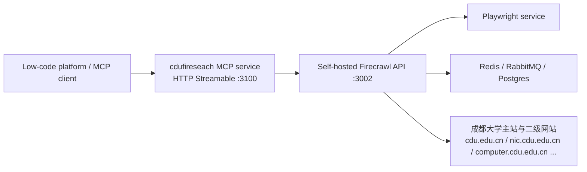

# cdufireseach

`cdufireseach` is a Chengdu University (`cdu.edu.cn`) MCP project built on top
of a self-hosted Firecrawl stack.

This repository has two layers:

- a self-hosted Firecrawl backend deployment
- a custom TypeScript MCP service focused on Chengdu University secondary sites

The target scenario is a low-code platform or AI agent platform that can
connect to MCP over `Streamable HTTP` and ask questions such as:

- `信息网络中心在哪里？`
- `计算机学院首页有哪些主要栏目？`
- `成都大学有哪些院系二级网站？`

## What It Does

This project is designed to:

- discover Chengdu University secondary websites from `组织机构` and `院系设置`
- locate the most relevant secondary site from a natural-language question
- recursively inspect the matched site through self-hosted Firecrawl
- return either:
  - a direct answer when the page contains one
  - or a clear `没有找到` style response with analysis steps explaining why

The current implementation already supports:

- secondary site catalog discovery
- site lookup by organization, alias, or department name
- controlled recursive page discovery within the matched subsite
- question-oriented extraction with lightweight analysis traces
- focused field extraction for `办公地点 / 联系电话 / 邮箱` style questions

## Repository Structure

Key paths:

- [cdufireseach/](./cdufireseach): custom MCP server
- [docker-compose.yml](./docker-compose.yml): self-hosted Firecrawl deployment
- [CDU_MCP_DESIGN.md](./CDU_MCP_DESIGN.md): initial design draft
- [.env.example](./.env.example): root deployment environment template

The custom MCP service lives under [cdufireseach/](./cdufireseach) and exposes one MCP tool:

- `ask_cdu`

## Architecture

The runtime flow is:



Typical request path:

```text
User question
  -> ask_cdu
  -> infer matched CDU subsite
  -> recursive Firecrawl scrape within same site
  -> prefer focused field extraction from the matched department/section block
  -> fallback to page-level generic contact info only when needed
  -> MCP response
```

The self-hosted Docker stack started from [docker-compose.yml](./docker-compose.yml)
includes:

- `firecrawl-api`
- `playwright-service`
- `redis`
- `rabbitmq`
- `nuq-postgres`
- `firecrawl-mcp`

The custom MCP service in [cdufireseach/](./cdufireseach) runs separately and
talks to the Firecrawl API at port `3002`.

Default ports:

- `3100`: custom MCP service `cdufireseach`
- `3002`: self-hosted Firecrawl API
- `3000`: official Firecrawl MCP adapter from the Docker stack

For this repository, the main MCP endpoint you usually connect to is:

- `http://<host>:3100/mcp`

## Startup Flow

There are two startup steps:

### Step 1. Start the Firecrawl backend Docker services

From the repository root:

```bash
cp .env.example .env
docker compose up -d
```

Check whether the backend is healthy:

```bash
docker compose ps
docker compose logs --tail=200 firecrawl-api
docker compose logs --tail=200 firecrawl-mcp
curl http://127.0.0.1:3002/health
```

If you want to verify scraping directly:

```bash
curl -X POST http://127.0.0.1:3002/v2/scrape \
  -H 'Content-Type: application/json' \
  -d '{
    "url": "https://nic.cdu.edu.cn/",
    "formats": ["markdown"]
  }'
```

### Step 2. Start the custom `cdufireseach` MCP service

```bash
cd cdufireseach
cp .env.example .env
npm install
npm run build
npm start
```

Check the MCP service:

```bash
curl http://127.0.0.1:3100/healthz
```

### Step 3. Connect your MCP client or low-code platform

Use:

- Transport: `HTTP Streamable`
- URL: `http://127.0.0.1:3100/mcp`

If your platform supports a JSON config entry, it will typically look like:

```json
{
  "mcpServers": {
    "cdufireseach": {
      "transport": "streamable-http",
      "url": "http://127.0.0.1:3100/mcp"
    }
  }
}
```

## Example Questions

These are representative questions the MCP service is built to handle:

- `信息网络中心在哪里？`
- `网络信息中心在哪里？`
- `信息网络中心的联系电话是什么？`
- `成都大学有哪些院系二级网站？`
- `计算机学院官网是什么？`
- `计算机学院首页有哪些主要栏目？`

## Local Test Script

The repository includes a local smoke-test script:

- [cdufireseach/scripts/test-mcp.sh](./cdufireseach/scripts/test-mcp.sh)

Example:

```bash
QUESTION="网络信息中心在哪里？" ./cdufireseach/scripts/test-mcp.sh
```

If you want to force a specific site during debugging:

```bash
SITE_NAME="信息网络中心" QUESTION="信息网络中心在哪里？" ./cdufireseach/scripts/test-mcp.sh
```

## Firecrawl Notes

This repository uses self-hosted Firecrawl rather than Firecrawl Cloud.

In this environment, an important deployment detail was:

- `ALLOW_LOCAL_WEBHOOKS=true`

That was needed because the target site resolved to a reserved address range in
the container network, and Firecrawl's default safe-fetch protection blocked the
requests.

## Current Status

Current state of the project:

- self-hosted Firecrawl backend is up
- custom MCP service is running in Firecrawl-only mode
- stub fallback has been removed from the runtime path
- natural-language question to site matching is working
- only one MCP tool is exposed publicly: `ask_cdu`
- recursive in-site page discovery is working with configurable depth/page limits
- address / phone / email style questions prefer focused section-level fields
  before falling back to footer or page-level contact information

## Next Improvements

- improve secondary-site matching for more aliases and wording variations
- add more page-layout-aware extraction rules for card or table based department pages
- add persistent cache or storage for lower scrape cost and more stable answers
- add focused tests for parser and extraction logic

## References

- [Firecrawl Repository](https://github.com/firecrawl/firecrawl)
- [Firecrawl MCP Repository](https://github.com/firecrawl/firecrawl-mcp-server)
- [Firecrawl MCP Docs](https://docs.firecrawl.dev/mcp-server)
- [Self-Hosting Guide](https://docs.firecrawl.dev/contributing/self-host)
