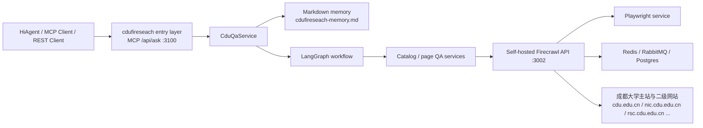

# cdufireseach

`cdufireseach` is a Chengdu University (`cdu.edu.cn`) Q&A project built on top
of a self-hosted Firecrawl stack.

This repository has two layers:

- a self-hosted Firecrawl backend deployment
- a custom TypeScript QA service focused on Chengdu University secondary sites

The target scenario is a low-code platform or AI agent platform that can
either connect to MCP over `Streamable HTTP` or call a REST API directly and
ask questions such as:

- `信息网络中心在哪里？`
- `网络信息中心在哪里？`
- `人事处人事科在哪里？`
- `计算机学院首页有哪些主要栏目？`
- `信息网络中心的联系电话是什么？`

## What It Does

This project is designed to:

- answer repeated high-frequency questions from a Markdown long-term memory file first
- discover Chengdu University secondary websites from `组织机构` and `院系设置`
- locate the most relevant secondary site from a natural-language question
- recursively inspect the matched site through self-hosted Firecrawl when memory misses
- return either:
  - a direct answer when the page contains one
  - or a clear `没有找到` style response with analysis steps explaining why

The current implementation already supports:

- Markdown long-term memory for stable `位置 / 电话 / 邮箱` style questions
- secondary site catalog discovery
- site lookup by organization, alias, or department name
- controlled recursive page discovery within the matched subsite
- LangGraph-based internal QA orchestration
- MCP and REST dual entrypoints over the same QA service
- question-oriented extraction with lightweight analysis traces
- focused field extraction for `办公地点 / 联系电话 / 邮箱` style questions

## Repository Structure

Key paths:

- [cdufireseach/](./cdufireseach): custom MCP server
- [docker-compose.yml](./docker-compose.yml): self-hosted Firecrawl deployment
- [CDU_MCP_DESIGN.md](./CDU_MCP_DESIGN.md): initial design draft
- [CDU_LANGCHAIN_REFACTOR_DESIGN.md](./CDU_LANGCHAIN_REFACTOR_DESIGN.md): LangChain / LangGraph refactor plan
- [CDU_QA_MEMORY_CACHE_DESIGN.md](./CDU_QA_MEMORY_CACHE_DESIGN.md): Markdown memory design
- [cdufireseach-memory.md](./cdufireseach-memory.md): human-maintained long-term memory file
- [cdufireseach-memory-candidates.md](./cdufireseach-memory-candidates.md): auto-generated candidate memory file
- [.env.example](./.env.example): root deployment environment template

The custom service lives under [cdufireseach/](./cdufireseach) and exposes one MCP tool:

- `ask_cdu`

It also exposes one REST endpoint:

- `POST /api/ask`

## Architecture

The runtime flow is:



Typical request path:

```text
User question
  -> ask_cdu (MCP) or POST /api/ask (REST)
  -> check Markdown long-term memory first
  -> if missed, infer matched CDU subsite
  -> run LangGraph QA workflow
  -> recursive Firecrawl scrape within same site
  -> prefer focused field extraction from the matched department/section block
  -> fallback to page-level generic contact info only when needed
  -> structured answer / evidence / analysis_steps
```

The self-hosted Docker stack started from [docker-compose.yml](./docker-compose.yml)
includes:

- `firecrawl-api`
- `playwright-service`
- `redis`
- `rabbitmq`
- `nuq-postgres`
- `firecrawl-mcp`

The custom MCP service in [cdufireseach/](./cdufireseach) runs separately and
talks to the Firecrawl API at port `3002`.

Default ports:

- `3100`: custom MCP service `cdufireseach`
- `3002`: self-hosted Firecrawl API
- `3000`: official Firecrawl MCP adapter from the Docker stack

For this repository, the main endpoints you usually connect to are:

- `http://<host>:3100/mcp`
- `http://<host>:3100/api/ask`

## Startup Flow

There are two startup steps:

### Step 1. Start the Firecrawl backend Docker services

From the repository root:

```bash
cp .env.example .env
docker compose up -d
```

Check whether the backend is healthy:

```bash
docker compose ps
docker compose logs --tail=200 firecrawl-api
docker compose logs --tail=200 firecrawl-mcp
curl http://127.0.0.1:3002/health
```

If you want to verify scraping directly:

```bash
curl -X POST http://127.0.0.1:3002/v2/scrape \
  -H 'Content-Type: application/json' \
  -d '{
    "url": "https://nic.cdu.edu.cn/",
    "formats": ["markdown"]
  }'
```

### Step 2. Start the custom `cdufireseach` QA service

```bash
cd cdufireseach
cp .env.example .env
npm install
npm run build
npm start
```

Check the service:

```bash
curl http://127.0.0.1:3100/healthz
```

### Step 3A. Connect your MCP client or low-code platform

Use:

- Transport: `HTTP Streamable`
- URL: `http://127.0.0.1:3100/mcp`

If your platform supports a JSON config entry, it will typically look like:

```json
{
  "mcpServers": {
    "cdufireseach": {
      "transport": "streamable-http",
      "url": "http://127.0.0.1:3100/mcp"
    }
  }
}
```

### Step 3B. Connect HiAgent or any REST client

Use:

- Method: `POST`
- URL: `http://127.0.0.1:3100/api/ask`
- Content-Type: `application/json`

Example:

```bash
curl -X POST http://127.0.0.1:3100/api/ask \
  -H 'Content-Type: application/json' \
  -d '{
    "question": "人事处人事科在哪里？"
  }'
```

Typical response fields:

- `answered`
- `answer`
- `evidence`
- `analysis_steps`
- `matched_site`
- `source_urls`

## Example Questions

These are representative questions the MCP service is built to handle:

- `信息网络中心在哪里？`
- `网络信息中心在哪里？`
- `信息网络中心的联系电话是什么？`
- `人事处人事科在哪里？`
- `人事处人事科电话是多少？`
- `计算机学院官网是什么？`
- `计算机学院首页有哪些主要栏目？`

## Local Test Script

The repository includes a local smoke-test script:

- [cdufireseach/scripts/test-mcp.sh](./cdufireseach/scripts/test-mcp.sh)

Example:

```bash
QUESTION="网络信息中心在哪里？" ./cdufireseach/scripts/test-mcp.sh
```

If you want to force a specific site during debugging:

```bash
SITE_NAME="信息网络中心" QUESTION="信息网络中心在哪里？" ./cdufireseach/scripts/test-mcp.sh
```

The same question can also be tested through REST:

```bash
curl -X POST http://127.0.0.1:3100/api/ask \
  -H 'Content-Type: application/json' \
  -d '{
    "question": "网络信息中心在哪里？"
  }'
```

## Firecrawl Notes

This repository uses self-hosted Firecrawl rather than Firecrawl Cloud.

In this environment, an important deployment detail was:

- `ALLOW_LOCAL_WEBHOOKS=true`

That was needed because the target site resolved to a reserved address range in
the container network, and Firecrawl's default safe-fetch protection blocked the
requests.

## Current Status

Current state of the project:

- self-hosted Firecrawl backend is up
- custom QA service is running in `firecrawl + markdown-memory` mode
- stub fallback has been removed from the runtime path
- long-term memory hits can bypass live crawling entirely
- high-confidence live answers can now be auto-written into formal memory
- medium/low-confidence live answers are written into candidate memory for review
- natural-language question to site matching is working
- only one MCP tool is exposed publicly: `ask_cdu`
- one REST endpoint is exposed publicly: `POST /api/ask`
- recursive in-site page discovery is working with configurable depth/page limits
- LangGraph is the internal ask orchestration layer
- address / phone / email style questions prefer focused section-level fields
  before falling back to footer or page-level contact information

## Next Improvements

- improve secondary-site matching for more aliases and wording variations
- add more page-layout-aware extraction rules for card or table based department pages
- evolve Markdown memory into a maintainable long-term knowledge asset
- add focused tests for parser, memory matching, and LangGraph tool behavior

## References

- [Firecrawl Repository](https://github.com/firecrawl/firecrawl)
- [Firecrawl MCP Repository](https://github.com/firecrawl/firecrawl-mcp-server)
- [Firecrawl MCP Docs](https://docs.firecrawl.dev/mcp-server)
- [Self-Hosting Guide](https://docs.firecrawl.dev/contributing/self-host)
